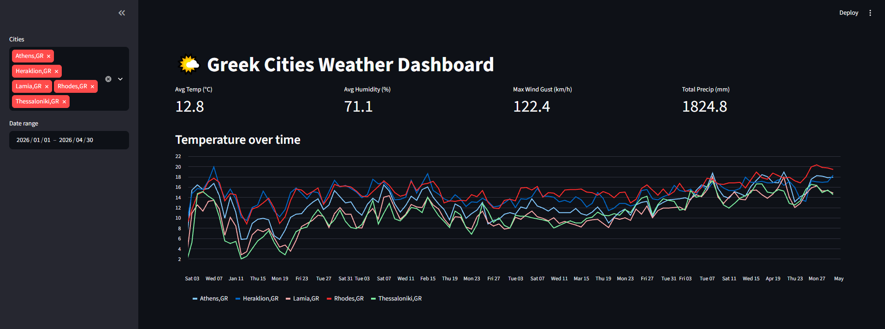
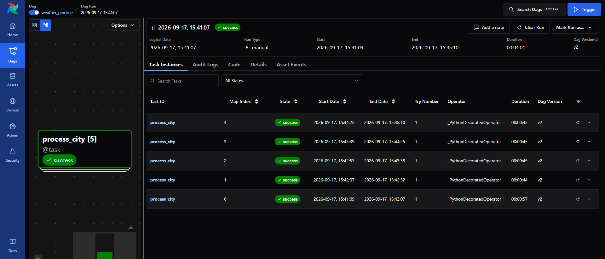

# 🌤️ Greek Cities Weather ETL Pipeline

An automated daily ETL pipeline that pulls weather data for five Greek cities from the Visual Crossing API, validates and transforms it, and loads it into an Azure SQL star-schema warehouse — visualized through a live Streamlit dashboard. Built with Apache Airflow, fully Dockerized.


---

## 📸 Screenshots

### Dashboard


### Airflow DAG


---

## 🏗️ Architecture

```
Visual Crossing API
        │
        ▼
  Airflow DAG (daily, 02:00 UTC)
        │
   ┌────┴────┐
   │ Extract │  src/ingestion/api.py
   └────┬────┘
        ▼
  ┌────────────┐
  │ Transform  │  src/transformation/transform.py
  │ & Validate │  (range checks, dedup, type coercion)
  └─────┬──────┘
        ▼
  ┌────────────┐
  │    Load    │  src/database/db.py
  └─────┬──────┘
        ▼
  Azure SQL (Star Schema)
   ├── Dim_Location
   ├── Dim_Date
   ├── Dim_Condition
   └── Fact_Weather_Daily
        │
        ▼
  Streamlit Dashboard (dashboard/app.py)
```

---

## ✨ Features

- **Automated daily ingestion** for 5 Greek cities (Athens, Thessaloniki, Heraklion, Rhodes, Lamia), scheduled via Airflow cron
- **Data validation layer** — range checks, cross-field consistency (e.g. `tempmin ≤ temp ≤ tempmax`), duplicate detection, and anomaly flagging (e.g. wind gust < wind speed)
- **Idempotent loading** — re-running a date/city combination skips existing rows rather than duplicating them
- **Star-schema warehouse** in Azure SQL for efficient historical querying
- **Interactive dashboard** with city/date filtering, temperature & humidity trends, and conditions breakdown
- **Retry logic** at both the HTTP layer (exponential backoff on transient API errors) and the Airflow task layer (automatic retries with backoff on failure)
- **Fully containerized** — one `docker compose up` runs the entire stack (Airflow, Postgres metadata DB, Redis, Streamlit)

---

## 🛠️ Tech Stack

| Layer | Technology |
|---|---|
| Orchestration | Apache Airflow 3.0 (CeleryExecutor) |
| Language | Python 3.12 |
| Data processing | pandas |
| Database | Azure SQL Database |
| DB access | SQLAlchemy + pyodbc |
| Dashboard | Streamlit |
| Containerization | Docker Compose |
| Weather source | [Visual Crossing Weather API](https://www.visualcrossing.com/weather-api) |

---

## 🚀 Getting Started

### Prerequisites

- Docker Desktop (4GB+ RAM allocated, 10GB+ free disk space)
- An Azure SQL Database instance (or adapt `DB_URL` for another SQL Server-compatible target)
- A free [Visual Crossing API key](https://www.visualcrossing.com/sign-up)

### 1. Clone the repo

```bash
git clone https://github.com/alex-m-programmer/greece-weather-trends.git
cd greece-weather-trends
```

### 2. Set up the database schema

Run `sql/schema.sql` once against your Azure SQL database (e.g. via Azure Data Studio, SSMS, or `sqlcmd`) to create the dimension and fact tables.

### 3. Configure environment variables

Create a `.env` file in the project root (see `.env.example` for the template):

```env
DB_URL=mssql+pyodbc://<user>:<password>@<server>.database.windows.net:1433/<database>?driver=ODBC+Driver+18+for+SQL+Server&Encrypt=yes&TrustServerCertificate=no&Connection+Timeout=30
WEATHER_API_KEY=<your-visual-crossing-api-key>
```

### 4. Start the stack

```bash
cd airflow
docker compose --env-file ../.env up -d
```

### 5. Unpause the DAG


```bash
docker compose exec airflow-apiserver airflow dags unpause weather_pipeline
```

### 6. Access the services

| Service | URL |
|---|---|
| Airflow UI | http://localhost:8080 |
| Streamlit Dashboard | http://localhost:8501 |

---

## ⏰ Schedule

The DAG runs daily at **02:00 UTC time**, pulling the **previous day's** finalized weather data (Visual Crossing blends live/forecast data for the current day, so yesterday's data is used to ensure only finalized observations are stored).

---

## 📁 Project Structure

```
.
├── airflow/
│   ├── dags/
│   │   └── weather_dag.py
│   ├── docker-compose.yaml
│   ├── Dockerfile
│   └── .env.example
│
├── src/
│   ├── ingestion/
│   │   └── api.py
│   ├── transformation/
│   │   └── transform.py
│   └── database/
│       └── db.py
│
├── dashboard/
│   └── app.py
│
├── sql/
│   └── schema.sql
│
├── docs/
│   └── screenshots/
│       ├── dashboard.png
│       └── dag_graph.png
│
├── config.py
├── requirements.txt
└── .env.example
```

---

## 🧠 Design Decisions

- **Sequential (non-concurrent) city processing** — chosen to respect the Visual Crossing free-tier rate limits and avoid Azure SQL write contention/deadlocks on shared dimension tables.
- **No CI/CD pipeline** — intentionally scoped out; this project focuses on the ETL/orchestration/warehouse design rather than deployment automation.
- **Idempotent fact inserts** — the fact table has a unique constraint on `(date_key, location_key)`, and `insert_weather_fact` checks for existing rows before inserting, so re-running any date/city combination is always safe.

---

## 🔭 Possible Future Improvements

- Add automated tests for the transformation/validation logic
- Add CI/CD (build + lint checks on push)
- Add alerting (email/Slack) on DAG failure
- Expand to additional cities or a configurable city list via UI

---

## 📄 License

This project is licensed under the MIT License.
